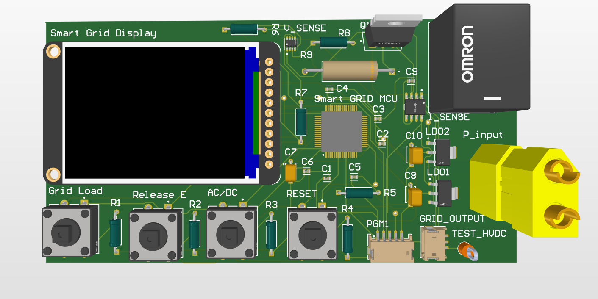

#  1st place - Smart Energy Grid PCB for the coldest inhabited city in the world

[](LICENSE)

| Competition Poster | 3D PCB Render |
|--------------------|---------------|
|  |  |

> Concept design of a modular smart grid PCB for Yakutsk, Russia — one of the coldest inhabited cities in the world.  
> Focused on renewable integration, local resilience, and efficient power distribution under extreme climate conditions.

> Concept design of a modular smart grid PCB for Yakutsk, Russia — one of the coldest inhabited cities in the world.  
> Focused on renewable integration, local resilience, and efficient power distribution under extreme climate conditions.

---

## Project Context
Yakutsk faces **extreme subarctic winters** (−40 °C average) and heavy reliance on fossil fuels.  
This design proposes a **localized smart energy grid** to improve efficiency, reduce environmental impact, and integrate **renewable energy** sources.

---
## System Architecture

| Block Diagram |
|---------------|
|  |

>This diagram shows the modular smart grid design — integrating renewable sources, energy storage, local distribution, and fault-tolerant switching for Yakutsk's extreme climate.

---

## PCB Design Overview
| 3D PCB Render | Schematic |
|---------------|-----------|
|  |  |

**Key PCB Features:**
- **Microcontroller-based control** for real-time grid monitoring
- **Relay switching** for load management and fault isolation
- **Sensor integration** for temperature, voltage, and current measurement
- Designed for **robust performance in extreme cold** with industrial-grade components

---

## Sustainability Impact
- Reduces reliance on long-distance fuel transport
- Enables local microgrid operation with renewable inputs
- Improves fault tolerance and recovery during severe weather events

---

## Competition
- Designed for the **Sustainable Energy Association (SEA) Smart Energy Competition**
- Delivered **technical poster** and **pitch presentation** (see [docs/](docs) for materials)

---

## 📂 Repository Structure
```
images/ # PCB render, schematic, diagrams
docs/ # Poster, slides, and competition deliverables
README.md
LICENSE
```


---

## Author
[](https://www.linkedin.com/in/hyeonjijung/)